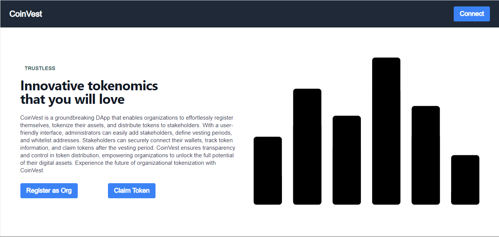

# PROJECT LANDING PAGE SNAPSHOT



#### CoinVest is a groundbreaking DApp that enables organizations to effortlessly register themselves, tokenize their assets, and distribute tokens to stakeholders. With a user-friendly interface, administrators can easily add stakeholders, define vesting periods, and whitelist addresses. Stakeholders can securely connect their wallets, track token information, and claim tokens after the vesting period. CoinVest ensures transparency and control in token distribution, empowering organizations to unlock the full potential of their digital assets. Experience the future of organizational tokenization with CoinVest.


**/contract/token.sol**
#### This documentation provides a detailed overview of the Token contract, which is used to create and manage custom ERC20 tokens. The Token contract extends the functionality of the OpenZeppelin ERC20 and ERC20Burnable contracts.

## Table of Contents

1. [Token Overview](#overview)
2. [Contract Structure](#contract-structure)
3. [Mappings](#mappings)
4. [Constructor](#constructor)
5. [Token Public Functions](#public-functions)
    - [supply()](#supply)
    - [burn(address _address, uint _value)](#burn)
    - [wire(address _to, uint _value)](#wire)
    - [getBalance(address account)](#getbalance)


6. [coinVest.sol Overview](#overview1) 
7. [Contract Structure](#contract-structure1)
8. [Modifiers](#modifiers)
9. [State Variables](#state-variables)
10. [Organization Model](#organization-model)
11. [Stakeholder Model](#stakeholder-model)
12. [CoinVest Public Functions](#public_functions)
    - [registerAsOrg()](#registerAsOrg)
    - [getOrgs()](#getOrgs)
    - [orgToken()](#orgToken)
    - [setVestingDetails()](#setVestingDetails)
    - [setWhitelist()](#setWhitelist)
    - [claimTokensFor()](#claimTokensFor)
    - [claimTokens()](#claimTokens)

## Token Overview <a name="overview"></a>

The Token contract is designed to facilitate the creation and management of ERC20 tokens. It provides functions for minting tokens, burning tokens, transferring tokens, and retrieving balance information. The contract utilizes the OpenZeppelin ERC20 and ERC20Burnable contracts, which provide a solid foundation for token functionality.

## Contract Structure <a name="contract-structure"></a>

The Token contract is structured as follows:

```solidity
contract Token is ERC20, ERC20Burnable {
    // Contract code here
}
```
The contract inherits from the ERC20 and ERC20Burnable contracts provided by the OpenZeppelin library. This allows the Token contract to utilize the standard ERC20 token functionality, including transfer, balance management, and burning capabilities.

Mappings <a name="mappings"></a>
The Token contract includes the following mappings:
```solidity
mapping (address => uint) public balance; 
mapping (address => uint) public balances;
```	
The balance mapping stores the balance of each individual account address.
The balances mapping also stores the balance of each individual account address.
These mappings are used to keep track of the token balances for different accounts.

Constructor <a name="constructor"></a>
The constructor function of the Token contract is responsible for initializing the contract and minting the initial token supply. It takes the following parameters:

```solidity
constructor(string memory _orgName, string memory _symbol, uint _totalSupply) ERC20(_orgName, _symbol) {
    _mint(address(this), _totalSupply);
    TotalSupply = _totalSupply;
}
```
_orgName: The name of the organization.
_symbol: The symbol of the token.
_totalSupply: The initial total supply of tokens.
The constructor initializes the ERC20 token by calling the ERC20 constructor with the organization name and symbol. It then mints the specified _totalSupply amount of tokens and assigns it to the contract address (address(this)).

``Public Functions`` <a name="public-functions"></a>: 
The Token contract provides several public functions for interacting with the token. These functions include:

View the Total Token Supply <a name="supply"></a>

```solidity
supply()
```


```solidity
function supply() public view returns (uint) {
    return TotalSupply;
}
```	
The supply() function allows you to view the total supply of tokens. It returns the value of the TotalSupply variable.

Burn Tokens <a name="burn"></a>
```solidity
burn(address _address, uint _value) 
```	

```solidity
function burn(address _address, uint _value) public {
    require(_address != address(0), "Address not valid");
    require(_value <= TotalSupply, "Value exceeds total supply");
    TotalSupply -= _value;
    balance[_address] = TotalSupply;
}
```	
The burn() function enables the burning (destruction) of tokens. It takes the following parameters:

_address: The address from which tokens will be burned.
_value: The amount of tokens to be burned.

#### The function performs the following steps:

Checks if the provided _address is valid (not the zero address).
Verifies that the _value to be burned is not greater than the total supply of tokens.
Subtracts the _value from the TotalSupply variable.
Updates the balance of the _address in the balance mapping.


Transfer Tokens <a name="wire"></a>

```Solidity
wire(address _to, uint _value)
```

```solidity
function wire(address _to, uint _value) public {
    require(_to != address(0), "Address not valid");
    require(_value <= TotalSupply, "Value exceeds total supply");
    balances[_to] += _value;
}
```	
The wire() function allows the transfer of tokens to a specified address. It takes the following parameters:

_to: The address to which tokens will be transferred.
_value: The amount of tokens to be transferred.

#### The function performs the following steps:

Checks if the provided _to address is valid (not the zero address).

Verifies that the _value to be transferred is not greater than the total supply of tokens.

Adds the _value to the balance of the _to address in the balances mapping.

Get Account Balance <a name="getbalance"></a>
```solidity
getBalance(address account)
```

```solidity
function getBalance(address account) public view returns (uint) {
    return balances[account];
}
```
The getBalance() function allows you to retrieve the balance of a specific account address. It takes the account parameter, which is the address for which you want to check the balance. The function returns the balance associated with the provided account address from the balances mapping.

This token contract provides the necessary functions and mappings to manage each custom ERC20 tokens, including minting, burning, transferring, and balance retrieval.


### CoinVest Contract:   **/contract/coinVest.sol**


Following is an overview of the CoinVest contract, which is responsible for managing organizations and stakeholders in the CoinVest platform. The contract facilitates the registration of organizations, creation of organization-specific tokens, setting vesting details for stakeholders, whitelisting stakeholders, and enabling token claims. 

The CoinVest contract incorporates the Token contract for token-related functionality and utilizes the OpenZeppelin contracts for access control.


CoinVest Overview <a name="overview1"></a>

The CoinVest contract is designed to manage organizations and stakeholders in the CoinVest platform. It enables organizations to register, create their own tokens, set vesting details for stakeholders, whitelist stakeholders, and facilitate token claims. The contract ensures that only registered organizations and whitelisted stakeholders can perform specific actions. It leverages the Token contract for token-related functionality and employs access control through OpenZeppelin contracts.

Contract Structure <a name="contract-structure"></a>

The CoinVest contract is structured as follows:


The contract contains the main logic and functionality for managing organizations and stakeholders in the CoinVest platform.

Modifiers <a name="modifiers"></a>

The CoinVest contract includes the following modifiers:

`onlyOrg` : This modifier restricts the execution of a function to only registered organizations. It checks if the sender is a registered organization before proceeding.

`onlyWhitelisted` : This modifier restricts the execution of a function to only whitelisted stakeholders. It ensures that the sender is a whitelisted stakeholder before proceeding.
These modifiers enforce access control within the contract.

State Variables <a name="state-variables"></a>

The CoinVest contract includes the following state variables:

`orgs`: An array that stores the addresses of registered organizations.

`isOrg`: A mapping that keeps track of whether an address belongs to a registered organization.

`orgTokenBalances`: A mapping that stores the token balances of organization contracts.

`organisations`: A mapping that stores the details of registered organizations.

`orgTokenDetail`: A mapping that associates organization addresses with their corresponding token addresses.

`stakeholderDetails`: A mapping that stores the details of stakeholders.

`whitelistedAddresses`: A mapping that links organizations to their respective whitelisted stakeholder addresses.

These state variables are used to manage the registration, organization details, stakeholder details, and whitelisting of addresses.

Organization Model <a name="organization-model"></a>

The CoinVest contract defines an Organisation struct to represent organization details. The struct includes the following fields:

`name`: The name of the organization.

`admin`: The address of the organization's admin.

`symbol`: The symbol of the organization's token.

`totalSupply`: The total supply of the organization's token.

`registered`: A boolean indicating whether the organization is registered.

This model is used to store and retrieve information about registered organizations.

Stakeholder Model <a name="stakeholder-model"></a>

The CoinVest contract defines a Stakeholder struct to represent stakeholder details. The struct includes the following fields:

`admin`: The address of the stakeholder's admin.

`tag`: The type of the stakeholder.

`vestingPeriod`: The end timestamp of the stakeholder's vesting period.

`isWhitelisted`: A boolean indicating whether the stakeholder is whitelisted.

`balanceOfStake`: The balance of tokens allocated to the stakeholder.

This model is used to store and retrieve information about stakeholders.

CoinVest Public Functions <a name="public-functions"></a>

The CoinVest contract provides several public functions for interacting with the platform. These functions include:

`registerAsOrg()`: Register as an 
Organization <a name="#registerAsOrg"></a>

This function allows an organization to register itself in the CoinVest platform. It verifies the sender's address and adds it to the list of registered organizations.

getOrgs() : Get Registered Organizations <a name="getOrgs"></a>
This function returns an array of addresses representing the registered organizations in the CoinVest platform.

 Register Organization Token <a name="orgToken"></a>
```solidity
orgToken(string memory _orgName, string memory _symbol, uint _totalSupply)
```

This function enables an organization to register itself and create a unique token for its operations. The organization provides the name, symbol, and total supply of the token. The function deploys a new Token contract, associates it with the organization, and updates the organization's token details.


Set Vesting Details for Stakeholder <a name="setvestingdetails-set-vesting-details-for-stakeholder"></a>

```solidity
setVestingDetails(address _stakeholderAddr, string memory _tag, uint _amount, uint _vestingPeriod)
```

This function allows an organization to set vesting details for a specific stakeholder. The organization specifies the stakeholder's address, type, allocated token amount, and vesting period. The function validates the input and updates the stakeholder's details accordingly.

Whitelist Stakeholders <a name="setwhitelist-whitelist-stakeholders"></a>

```solidity
setWhitelist(address _stakeholderAddr)
```

This function enables an organization to whitelist a stakeholder, granting them permission to perform certain actions. The organization provides the stakeholder's address, and the function verifies its validity before adding it to the whitelist.


Claim Tokens for Stakeholder <a name="claimtokensfor-claim-tokens-for-stakeholder"></a>

```solidity
claimTokensFor(address _stakeholderAddr)
```

This function allows an organization to claim tokens on behalf of a specific stakeholder. The organization specifies the stakeholder's address, and the function verifies that the vesting period has elapsed before transferring the claimable tokens to the stakeholder.

Claim Tokens by a Whitelisted Stakeholder <a name="claimtokens-claim-tokens-for-whitelisted-stakeholder"></a>

```solidity
claimTokens() 
```

This function enables a whitelisted stakeholder to claim their tokens. The function verifies that the vesting period has elapsed and transfers the claimable tokens to the stakeholder's address. It also returns the stakeholder's updated token balance.

These functions provide the core functionality for organizations and stakeholders to interact with the CoinVest platform, including registration, token creation, vesting details management, whitelisting, and token claims.

Conclusion

The CoinVest contract serves as the backbone of the CoinVest platform, providing a robust framework for managing organizations and stakeholders. With its registration, token creation, vesting details, and whitelisting mechanisms, the contract enables secure and transparent operations within the platform. By following the documentation and utilizing the provided functions, non-technical users can easily navigate and understand the CoinVest contract's capabilities and features.
